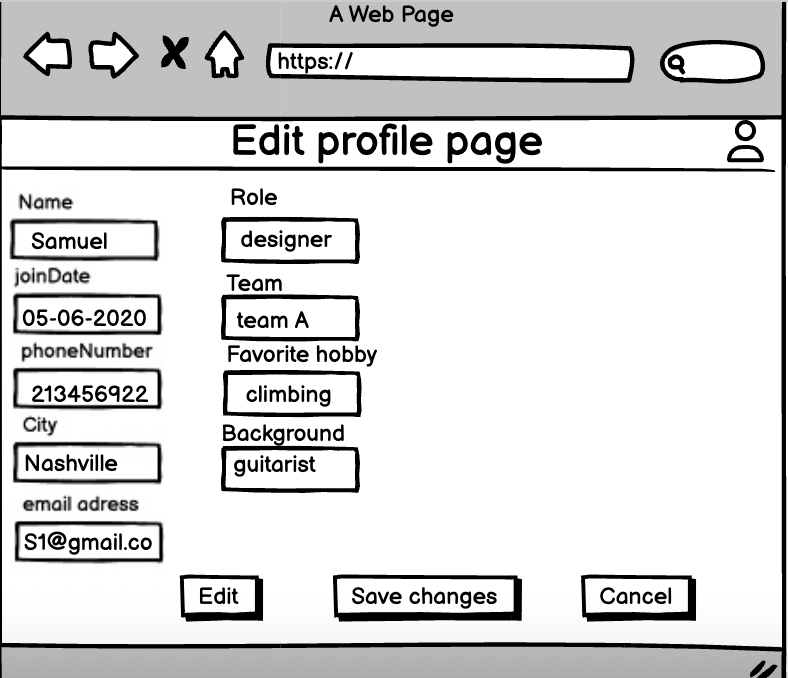

# Project Title
TeamInSynch
## Descirption
### Problem statement
Remote work is here to stay, and talent is everywhere, but there is a problem that presents itself when we're collaborating with varying degrees of geographical separation. Geography is context. How do we help managers overcome the challenges of managing a geographically dispersed team and fostering a sense of connection with their team memebers?
### Solution
Enter TeamInSynch. TeamInSynch is a dashboard for team managers designed to enhance synchronization with team members. It provides the manager with enough contextual information about each member of their team, from local news headlines to weather updates to the current time, so that managers can make better decisions in the workplace and thus increase productivity.

## User Stories
U1. 
As a team manager, I'd like to add a team member with all their info( email, joinDate, phoneNumber, Location.. etc).

U2. As a team manager, I'd like to delete a team member.

U3. As a team manager, I'd like to sign in to my account and update my location/contact info if needed and be able to edit member's info too.

U4. As a team manager, I'd like to retrieve members info by joinDate, location, timeZone, and name

U5.As a team manager, I'd like to see a dashboard of my team with local context(news headlines, weather info, time).

U5. As a team manager, I'd like to click on any member and see detailed info about local news headlines and local weather conditions at their location.

U6. As a team manager, I'd like to view a constantly changing list of only the active members.

U7. As a team manager, I'd like to setup meetings that automatically takes into consideration the local times of my team members

U8. As a team manager, I'd like to receive notifications if there are any major local news or major weather condition where my team members are located.

U9. As a team manager, I'd like to set my availability to active or not active.

## Stretch Goals

U1. As a team manager, I'd like the dashboard to display a random fact of the day about each team member's local heritage, changing daily, visible to all team members to enhance cultural awareness and team bonding.

U2. As a team manager, I'd like to reassign members to different teams as the project evolve or change

U3. As a team manager, I'd like to view suggested appointment times that are rendered everyday based on memebr's timezones

## Project Scope
### In scope
* Add, update, retrieve, and delete a team member using information like name, email, location, join date, and phone number. (Core functionalities)
* Retrieving and displaying weather data and local news headlines at each member's location. (The context needed so that the manager can better understand his team members' environments)
* Displaying a dashboard of the members on the manager's team, with snapshots of their real-time weather info, current time, and local news headlines. (The dashboard represents the central hub for managers for a quick overview of their team and the relevant context).

### Out of scope
* Daily automatic suggestions of appointment schedules that consider team members' time zones. (For future iterations)
* Ability to receive notifications in the event of major local news or weather conditions. (Good to have, but not key for the MVP)
Integration with third-party services like emails, fitness, and productivity apps.
* Ability to add teams at different levels in the organization and sub-teams, so that upper managers and organizations can get relevant data and reports on team performance metrics, productivity rates, etc. (This project is only for single-level management; multiple-level hierarchies are excluded.)

## Proposed Architectural Overview
For the first iteration, we will provide the minimum lovable product (MLP) which includes adding, updating, retrieving, and deleting a team member as well as retrieving weather updates, current time, and local headline news.

We will use API Gateway and Lambda to create the API endpoints (AddTeamMember, UpdateTeamMember, GetTeamMember, DeleteTeamMember, GetAllTeamMembers).

We will authenticate users using AWS Cognito.

We will store team members in a DynamoDB table. As for the weather data and local news, we will retrieve them in real-time from no authentication, Open third-party APIs, thereby avoiding storage overhead.

TeamInSynch will provide its users with a web interface for managers to learn about their teams. The main page will provide a list of members with the ability to see snapshots of contextual info, and let them update their team members' info and link off to pages for each member to show their detailed profiles.

## API
### Public Models
#### //MemberModel
* String Id;

* String name; 

* String email;

* String phoneNumber;

* String Location;

* ZonedDateTime joinDate;

* Boolean isActive;

#### //WeatherModel
* String location;

* ZonedDateTime updatedAt ;

* Double Temperature;

* String weatherCondition;

* String weatherDescription;

#### //NewsModel
* String location

* List<String> headlines;

* ZonedDateTime lastUpdated;

* List<String> sources;

* List<String> URLs;

### Add Team Member Endpoint
For each of the following API requests, we would need to authenticate the user aka manager before they're able to make the call:
* Accepts a POST request to /members
* Accepts data to create a new member with a provided name, a given ID, an email, a phone number, and location . Returns the new member with a unique Id assigned by the Team in synch service. 
##### UML sequence diagram representation:

### Update Team Member Endpoint
* Method: PUT
* Path: /members/:id
* Accepts data with memberId to update member info including name,phoneNumber,location, and email.
* Request Body: {"memberId": "string", "email": "string", "location": "string", "phoneNumber": "string"} partial Vs Full
* Response: Returns the updated member info.
* if the memberId is not found, we will throw memberNotFoundException
* for security concerns, we will validate name and location do not contain invalid characters; if that's the case, we will throw an invalidAttributeValueException

### Delete Team Member Endpoint
* Accepts DELETE request to members/:id
* Accepts memeberId to delete memeber associated with it. Returns success message.
* if the memberId is not found, we will throw memberNotFoundException
### Get Weather Endpoint
for the weather API, we will use openMeteo public API which requires no API key.

##### Retrieving weather information using the Open-Meteo Weather Forecast API:

* Accepts a request to the Open-Meteo Geocoding API with URL : https://geocoding-api.open-meteo.com/v1/search
* Parse the JSON response from the Geocoding API to extract the latitude and longitude coordinates of the city.
* If the city is not found by the Open-Meteo Geocoding API, throw a CityNotFoundException.
* Construct the API URL with the obtained coordinates and other query parameters like :
1. current_weather=true: To include current weather conditions 
2. daily=weathercode,temperature_2m_max,temperature_2m_min: To retrieve daily weather condition and maximum/minimum temperature data.
3. forecast_days={days}: To specify the number of forecast days (default is 7).
4. timezone={timezone}: To specify the timezone of the city (optional). 

* Accepts a GET request to the Open-Meteo Weather Forecast API endpoint with URL: https://api.open-meteo.com/v1/forecast

* Parse the JSON response to extract the relevant weather information. 
* Returns the following weather information: 
1. Current weather condition 
2. Current temperature
3. Daily weather data
 * returns data to the user
 #### error handling
* If the Open-Meteo Weather Forecast API returns an error or invalid response, we will throw  WeatherAPIException.
### Get News Endpoint
* method: GET
* Query Paramters: Location(optional)
* path: /news
* Response: returns a list of news headlines
* errors: newsNotFoundException

## Tables
### Members
id // partition key, string

joinDate // sort key, String

name // string

email // string 

phone number// number

location // string

## Pages
### Home page: 
### Sign in page: 
### Acount creation page: 
### profile page: 
#### eagle view: 
#### close-up: 
### edit Profile page: 

